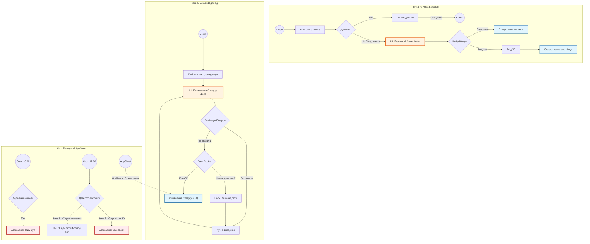

```mermaid
flowchart TD
    %% Стилі
    classDef status fill:#e1f5fe,stroke:#01579b,stroke-width:2px;
    classDef archive fill:#ffebee,stroke:#b71c1c,stroke-width:2px;
    classDef ai fill:#fff3e0,stroke:#e65100,stroke-width:2px;

    %% Гілка А: Нова вакансія
    subgraph BranchA [Гілка А: Нова Вакансія]
        A1((Старт)) --> A2[Ввід URL / Тексту]
        A2 --> A3{Дублікат?}
        A3 -- Так --> A4[Попередження]
        A4 -- Скасувати --> End1((Кінець))
        A3 -- Ні / Продовжити --> A5[ШІ: Парсинг & Cover Letter]:::ai
        A5 --> A6{Вибір Юзера}
        A6 -- Залишити --> A7[Статус: нова вакансія]:::status
        A6 -- Гоу далі --> A8[Ввід ЗП] --> A9[Статус: Надіслано відгук]:::status
    end

    %% Гілка Б: Відповідь
    subgraph BranchB [Гілка Б: Аналіз Відповіді]
        B1((Старт)) --> B2[Копіпаст тексту рекрутера]
        B2 --> B3[ШІ: Визначення Статусу/Дати]:::ai
        B3 --> B4{Валідація Юзером}
        B4 -- Виправити --> B5[Ручне введення] --> B3
        B4 -- Підтвердити --> B6{Date Blocker}
        B6 -- Немає дати події --> B7[Блок! Вимагає дату] --> B5
        B6 -- Все ОК --> B8[Оновлення Статусу в БД]:::status
    end

    %% Фонові задачі та Двовладдя
    subgraph Cron [Cron Manager & AppSheet]
        C1((AppSheet)) -.-> |God Mode: Пряма зміна| B8
        C2((Cron: 10:00)) --> C3{Дедлайн вийшов?}
        C3 -- Так --> C4[Авто-архів: Тайм-аут]:::archive
        C5((Cron: 12:00)) --> C6{Детектор Гостингу}
        C6 -- Фаза 1: >7 днів мовчання --> C7[Пуш: Надіслати Фоллоу-ап?]
        C6 -- Фаза 2: >3 дні після ФУ --> C8[Авто-архів: Загостили]:::archive
    end
```
